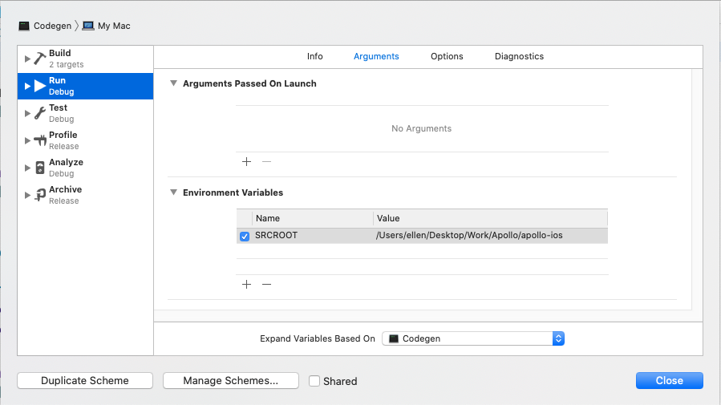

Apollo uses a Swift Package Manager-based wrapper to facilitate generating code and accessing our JS CLI in a Swift-friendly way. 

The wrapper calls through to the included binaries and files that constitute the `apollo` command-line interface. This ensures that you can use our tooling without having to worry about NPM Version Hell™, and that the version of the framework you're using is compatible with the version of the codegen you're using.

The recommended way to do this is to create an executable Swift script that can be run from a build phase run script. 

## Creating a Swift Executable

1. `cd` into the directory containing your `.xcodeproj` or `.xcworkspace` file using Terminal.
2. Still using Terminal, make a new folder, change directories into that folder, and initialize a Swift Package Manager executable:

    ```
    mkdir Codegen
    cd Codegen
    swift package init --type executable
    ```
    
3. Run `swift run`. You should see "Hello, world" printed at the command line. This confirms that the executable was created correctly. 
4. Open `Package.swift`.  Add the Apollo iOS version as a dependency package. Make sure you use the same version as you're using in your primary application!: 

    ```swift
    dependencies: [
      .package(
        url: "https://github.com/apollographql/apollo-ios.git",
        .exact("0.21.0")
      )
    ],
    ```

5. Then add `ApolloCodegenLib` to the dependencies of your `Codegen` target: 

    ```swift
    .target(
      name: "Codegen",
      dependencies: ["ApolloCodegenLib"]
    ),
    ```

6. In `main.swift`, add the following imports: 

    ```swift
    import Foundation
    import ApolloCodegenLib
    ```

7. Press the play button in Xcode to run the executable. You should once again see "Hello World!" output.

You've set up the package and successfully imported the code generation library. Next, you'll make it easy to run in Xcode locally so you can debug it with breakpoints.

## Making the executable easily runnable in Xcode

Since Swift Package Manager scripts don't have access to any information about the system around them, you have to manually set a couple things up in order to be able to easily debug your executable.

1. Edit the scheme Xcode automatically creates for you to set your `SRCROOT` as the directory containing your `.xcodeproj` or `.xcworkspace`: 

     
    Note that this needs to be the full path to your source root - it cannot be a relative path. This will be tied to a particular machine, but it will allow you to debug more easily.
   
2. Make sure the "Shared" checkbox is unchecked on your scheme since the `SRCROOT` environment variable you've added is tied to a specific machine.

## Setting up code generation options

1. Grab the `SRCROOT` path out of the environment, and turn it into a URL:

    ```swift
    guard let sourceRootPath = ProcessInfo.processInfo.environment["SRCROOT"] else {
        fatalError("Source root not provided")
    }
    
    let sourceRootURL = URL(fileURLWithPath: sourceRootPath)
    ```
2. Set up a URL to where you want the CLI to download. You may wish to put it under the same folder as your `Codegen` executable so it's clear what it's being used for:

    ```swift
    let cliFolderURL = sourceRootURL
        .appendingPathComponent("Codegen")
        .appendingPathComponent("ApolloCLI")
    ```

3. Set up the URL where the target you are generating code for lives, and where the CLI will be run from. This should be the folder which, at some depth, contains all your `.graphql` files: 

    ```swift
    let targetURL = sourceRootURL
        .appendingPathComponent("MyAppOrLibrary")
    ```

4. Set up your `ApolloCodegenOptions` object. If you'd like to use default options, you can use the convenience initializer which only requires the URL of the target: 

    ```swift
    ApolloCodegenOptions(targetRootURL: targetRootURL)
    ```
    
    Otherwise, you can use one of the direct initializers which has a list of all options. 
    
    Please see [the documentation of `ApolloCodegenOptions`](../api/ApolloCodegenLib/structs/ApolloCodegenOptions/) for all currently available options, and for details about what is included by default in the convenience initializer.
    
5. Build and run your project. You should now either see your Swift executable starting to download the CLI and eventually running the code, or you should see errors about what still needs to be set up. 

Once your Swift executable is running without issues, it's time to use it directly from within your app. 
    
## Integrating with your app

To run code generation as part of the Xcode build process, you need to create a build phase that runs your Swift script before the "Compile Sources" step. 

1. On your application target's **Build Phases** settings tab, click the **+** icon and choose **New Run Script Phase**. 
2. In the created Run Script, change its name to **Generate Apollo GraphQL API** 
3. Drag this new run script just above **Compile Sources** in your list of **Build Phases** so that it executes before your code is compiled.
4. Add the the following to change directories to your Codegen SPM executable and then run it:

```
cd "${SRCROOT}/Codegen"
swift run
```

>**Note**: Since it's being run from a build phase run script, the environment, including your `${SRCROOT}`, will be passed through to the Swift script automatically. 